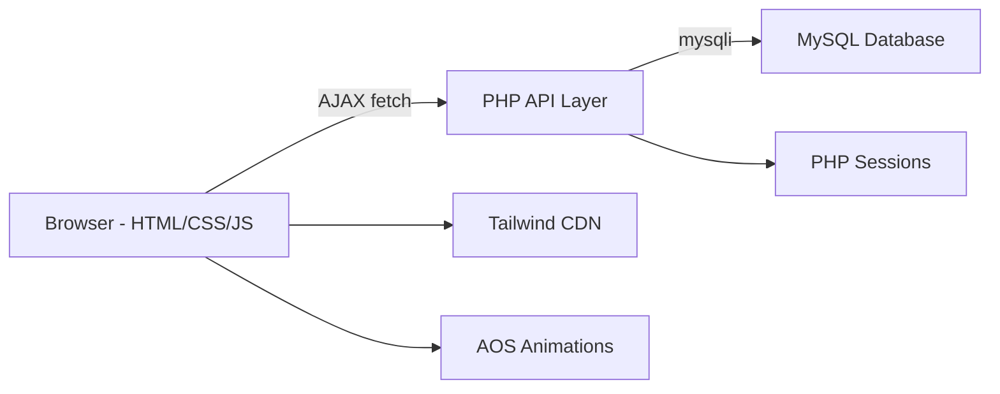

# Voyage Project — Complete Analysis Report

## Project Overview

**Voyage** is an India-focused travel booking demo/project website. It lets users browse travel destinations, hotels, and flights across India, create accounts, and make bookings. An admin dashboard allows managing destinations and viewing bookings/stats.

**Tech Stack:** HTML, CSS (Tailwind CDN + custom [voyage.css](file:///c:/xampp/htdocs/voyage-main/voyage.css)), JavaScript (vanilla + AJAX via `fetch`), PHP (REST API), MySQL (`voyage_db`), XAMPP.

### Architecture

| Layer | Files |
|-------|-------|
| **Pages** | [index.html](file:///c:/xampp/htdocs/voyage-main/index.html), [about.html](file:///c:/xampp/htdocs/voyage-main/about.html), [destinations.html](file:///c:/xampp/htdocs/voyage-main/destinations.html), [hotels.html](file:///c:/xampp/htdocs/voyage-main/hotels.html), [flights.html](file:///c:/xampp/htdocs/voyage-main/flights.html), [bookings.html](file:///c:/xampp/htdocs/voyage-main/bookings.html), [login.html](file:///c:/xampp/htdocs/voyage-main/login.html), [signup.html](file:///c:/xampp/htdocs/voyage-main/signup.html), [my-bookings.html](file:///c:/xampp/htdocs/voyage-main/my-bookings.html), [admin.html](file:///c:/xampp/htdocs/voyage-main/admin.html), [ping.html](file:///c:/xampp/htdocs/voyage-main/ping.html) |
| **JS** | [js/api.js](file:///c:/xampp/htdocs/voyage-main/js/api.js) (AJAX client), [js/auth-nav.js](file:///c:/xampp/htdocs/voyage-main/js/auth-nav.js) (session + nav), [js/data.js](file:///c:/xampp/htdocs/voyage-main/js/data.js) (legacy localStorage fallback) |
| **PHP API** | [api/config.php](file:///c:/xampp/htdocs/voyage-main/api/config.php), [api/auth.php](file:///c:/xampp/htdocs/voyage-main/api/auth.php), [api/destinations.php](file:///c:/xampp/htdocs/voyage-main/api/destinations.php), [api/bookings.php](file:///c:/xampp/htdocs/voyage-main/api/bookings.php), [api/stats.php](file:///c:/xampp/htdocs/voyage-main/api/stats.php), [api/ping.php](file:///c:/xampp/htdocs/voyage-main/api/ping.php) |
| **CSS** | [voyage.css](file:///c:/xampp/htdocs/voyage-main/voyage.css) (custom material-style classes, orbs, glassmorphism) |

---

## 1. Incomplete / Non-Working Items

### 🔴 Critical Issues

| # | Issue | Page(s) | Details |
|---|-------|---------|---------|
| 1 | **Google/Facebook login buttons are non-functional** | [login.html](file:///c:/xampp/htdocs/voyage-main/login.html), [signup.html](file:///c:/xampp/htdocs/voyage-main/signup.html) | The social login buttons (Google, Facebook) are purely decorative — they have no `onclick` handler, no OAuth integration. Clicking them does nothing. |
| 2 | **"Forgot password?" link is a dead `#` link** | [login.html](file:///c:/xampp/htdocs/voyage-main/login.html) | The "Forgot password?" anchor goes to `#` — no password reset flow exists. |
| 3 | **Language selector (EN/FRA) does nothing** | [index.html](file:///c:/xampp/htdocs/voyage-main/index.html) | The `<select>` dropdown for EN/FRA has no `onchange` handler. Switching languages has zero effect — no i18n is implemented. |
| 4 | **Footer links lead nowhere** | [about.html](file:///c:/xampp/htdocs/voyage-main/about.html), [index.html](file:///c:/xampp/htdocs/voyage-main/index.html) | Footer links like "Careers", "Mobile", "Help/FAQ", "Press", "Affiliates", "Airlinefees", "Airline", "Low fare tips" all link to `/` — they're placeholder stubs with no content pages. |
| 5 | **Terms & Conditions / Privacy Policy links are dead** | [signup.html](file:///c:/xampp/htdocs/voyage-main/signup.html) | The T&C and Privacy Policy links in the signup checkbox go to `#` — no legal pages exist. |
| 6 | **[data.js](file:///c:/xampp/htdocs/voyage-main/js/data.js) is an unused legacy file** | [js/data.js](file:///c:/xampp/htdocs/voyage-main/js/data.js) | This file uses `localStorage` for destinations/bookings. It's been replaced by [api.js](file:///c:/xampp/htdocs/voyage-main/js/api.js) + PHP backend, but the file still ships and could cause naming conflicts since it defines functions with the same names as [api.js](file:///c:/xampp/htdocs/voyage-main/js/api.js) ([getDestinations](file:///c:/xampp/htdocs/voyage-main/js/api.js#77-81), [getBookings](file:///c:/xampp/htdocs/voyage-main/js/data.js#217-221), etc.). No page currently loads it, but it's dead code. |
| 7 | **Hotels page — "Book Now" doesn't actually create a booking** | [hotels.html](file:///c:/xampp/htdocs/voyage-main/hotels.html) | The "Book Now" buttons on hotel cards link to `bookings.html?type=hotel&name=...` which pre-fills the booking form. However, the booking form on [bookings.html](file:///c:/xampp/htdocs/voyage-main/bookings.html) submits to the [addBooking](file:///c:/xampp/htdocs/voyage-main/js/api.js#114-117) API which only handles `destination_id`-based bookings — **hotel and flight bookings are not saved to the DB**. They follow a different schema. |
| 8 | **Flights page — "Book" buttons same issue** | [flights.html](file:///c:/xampp/htdocs/voyage-main/flights.html) | Same as hotels — the "Book" links redirect to `bookings.html?type=flight&...` but the backend [bookings.php](file:///c:/xampp/htdocs/voyage-main/api/bookings.php) only understands destination-based bookings. |
| 9 | **Flight search: departure date & passenger count are ignored** | [flights.html](file:///c:/xampp/htdocs/voyage-main/flights.html) | The flight search form has date and passenger inputs, but [searchFlights()](file:///c:/xampp/htdocs/voyage-main/flights.html#325-329) only filters by from/to city. The date and passenger count are completely unused. |
| 10 | **Hotel search: check-in/check-out dates are ignored** | [hotels.html](file:///c:/xampp/htdocs/voyage-main/hotels.html) | Same issue — the date pickers exist in the UI but the [searchHotels()](file:///c:/xampp/htdocs/voyage-main/hotels.html#259-265) function only filters by name/location text. |
| 11 | **"Round Trip" / "Multi-City" radio buttons do nothing** | [flights.html](file:///c:/xampp/htdocs/voyage-main/flights.html) | The trip type radio buttons (One Way, Round Trip, Multi-City) are never read by any JS logic. |
| 12 | **No "Contact Us" page** | All footers | The footer mentions "Contact" but there's no contact form or page. |
| 13 | **App Store / Play Store badges (index.html) are images with no links** | [index.html](file:///c:/xampp/htdocs/voyage-main/index.html) | The Google Play and App Store badge images ([GooglePlay.jpg](file:///c:/xampp/htdocs/voyage-main/images/GooglePlay.jpg), [PlayStore.jpg](file:///c:/xampp/htdocs/voyage-main/images/PlayStore.jpg)) appear in the footer/subscribe section but are just images — no link wrapping them. |
| 14 | **Subscribe/newsletter form on index.html** | [index.html](file:///c:/xampp/htdocs/voyage-main/index.html) | There is likely a subscribe email input — it has no backend integration and does nothing on submit. |

### 🟡 Minor / UX Issues

| # | Issue | Details |
|---|-------|---------|
| 15 | **[admin.html](file:///c:/xampp/htdocs/voyage-main/admin.html) has encoding issues** | Per previous conversations, Mojibake/encoding was partially fixed but may still have edge cases with special characters. |
| 16 | **No form validation feedback on bookings page** | [bookings.html](file:///c:/xampp/htdocs/voyage-main/bookings.html) has a complex multi-step form but error states could be more user-friendly. |
| 17 | **[my-bookings.html](file:///c:/xampp/htdocs/voyage-main/my-bookings.html) doesn't distinguish booking types** | The table shows `destination_name` but doesn't indicate if it was a hotel, flight, or destination booking. |
| 18 | **No favicon** | The site has no favicon — browser tabs show a generic icon. |
| 19 | **Copyright says "© 2024"** | Should be updated to 2025/2026 or use dynamic year. |
| 20 | **Mobile menu on [index.html](file:///c:/xampp/htdocs/voyage-main/index.html) uses different ID** | [index.html](file:///c:/xampp/htdocs/voyage-main/index.html) uses `id="mobile-menu"` while other pages use `id="mob-menu"`. The [auth-nav.js](file:///c:/xampp/htdocs/voyage-main/js/auth-nav.js) handles both patterns but this inconsistency is fragile. |

---

## 2. Project Understanding & Improvement Suggestions

### What the Project Does

Voyage is a **demo travel booking platform** for India that:
- Showcases Indian destinations (Goa, Jaipur, Kerala, Manali, Andaman, Agra) with details, pricing, and availability
- Lists luxury Indian hotels with filtering
- Shows popular domestic flight routes with city-based search
- Allows user signup/login (PHP sessions + bcrypt password hashing)
- Has a booking flow (destination → form → DB entry)
- Includes an admin dashboard for managing destinations and viewing stats
- Features a "My Bookings" page for logged-in users

### 💡 Improvement Suggestions (within HTML/CSS/JS/AJAX/PHP/SQL stack)

#### A. Complete the Core Booking Flow

| Improvement | Details |
|-------------|---------|
| **Support hotel & flight bookings in the DB** | Add `booking_type` column to the `bookings` table (`destination`/`hotel`/`flight`). Update [bookings.php](file:///c:/xampp/htdocs/voyage-main/api/bookings.php) to accept hotel name, flight details, etc. Update [bookings.html](file:///c:/xampp/htdocs/voyage-main/bookings.html) JS to send the correct payload based on `?type=`. |
| **Add booking confirmation page** | After a successful booking, redirect to a `/booking-confirmation.html?id=123` page that shows a formatted receipt/ticket with a print button. |
| **Add booking cancellation** | Allow users to cancel from [my-bookings.html](file:///c:/xampp/htdocs/voyage-main/my-bookings.html) with a "Cancel" button that calls a new `cancelBooking` API endpoint. |

#### B. Make Static Pages Dynamic

| Improvement | Details |
|-------------|---------|
| **Dynamic hotels from DB** | Move hotel data from hardcoded HTML into a `hotels` table in MySQL. Create `api/hotels.php` to serve them via AJAX, similar to destinations. This enables admin CRUD for hotels. |
| **Dynamic flights from DB** | Same approach — a `flights` table + `api/flights.php`. Admin can add/remove routes. |
| **Search with real filtering** | Make hotel/flight search use the date inputs. For hotels: filter by availability between check-in/check-out. For flights: show only routes on the selected date. |

#### C. Improve Authentication & Security

| Improvement | Details |
|-------------|---------|
| **Remove social login buttons or implement OAuth** | Either integrate Google OAuth 2.0 (free, well-documented) or remove the Google/Facebook buttons to avoid confusion. Since this is a demo, removing them is simpler. |
| **Add "Forgot Password" flow** | Create a `forgot-password.html` page → user enters email → PHP generates a token, stores in DB, and (for demo) shows the reset link on screen. A `reset-password.html` page reads the token and allows setting a new password. |
| **Add CSRF protection** | Generate a CSRF token in the PHP session and validate it on every POST request. |
| **Client-side input validation** | Add real-time validation hints (email format, password strength meter, confirm password match) on the signup form using JS. |

#### D. Enhance UX & Design Polish

| Improvement | Details |
|-------------|---------|
| **Add a Contact Us page** | Create `contact.html` with a form (name, email, subject, message) that saves to a `contact_messages` table via `api/contact.php`. |
| **Add a 404 error page** | Create a styled `404.html` page with a "Go Home" button. |
| **Add page loading skeletons** | On [destinations.html](file:///c:/xampp/htdocs/voyage-main/destinations.html) and [my-bookings.html](file:///c:/xampp/htdocs/voyage-main/my-bookings.html), show skeleton/shimmer placeholder cards while AJAX data loads instead of showing nothing. |
| **Add a favicon** | Create a simple orange "V" favicon matching the brand colors. |
| **Fix the copyright year** | Use `new Date().getFullYear()` in JS to auto-set the footer year. |
| **Add testimonials section to index.html** | The homepage has a "Testimonials" heading area. Add 3-4 traveller reviews with star ratings, photos, and a carousel using pure CSS/JS. |
| **Review/rating system** | Let users who have completed a booking leave a star rating + comment for the destination. Show average ratings on destination cards. |

#### E. Admin Dashboard Enhancements

| Improvement | Details |
|-------------|---------|
| **Hotel & flight management** | Add tabs/sections in [admin.html](file:///c:/xampp/htdocs/voyage-main/admin.html) to CRUD hotels and flights (once they're DB-driven). |
| **Booking management** | Allow admin to change booking status (Confirmed/Pending/Cancelled) from the dashboard. |
| **User management** | Add a "Users" section showing registered users, with ability to deactivate accounts. |
| **Dashboard charts** | Add simple bar/pie charts for popular destinations, monthly bookings, revenue — using a lightweight JS charting library or even pure CSS bar charts. |

#### F. Technical Improvements

| Improvement | Details |
|-------------|---------|
| **Remove [data.js](file:///c:/xampp/htdocs/voyage-main/js/data.js)** | Delete [js/data.js](file:///c:/xampp/htdocs/voyage-main/js/data.js) since it's been fully replaced by [api.js](file:///c:/xampp/htdocs/voyage-main/js/api.js). It contains hardcoded admin credentials which is a security concern. |
| **Extract shared navbar into a component** | The navbar HTML is duplicated across 11 pages. Create a `components/navbar.html` and use JS `fetch` to load it into each page, or use PHP includes if serving through Apache. |
| **Add `.htaccess` for clean URLs** | Use Apache mod_rewrite to enable `/destinations` instead of [/destinations.html](file:///c:/xampp/htdocs/voyage-main/destinations.html). |
| **Add SQL schema file** | Create a `database/schema.sql` with `CREATE TABLE` statements for `users`, `admins`, `destinations`, `bookings`, making the project easy to set up from scratch. |
| **Add a README.md** | Document how to set up XAMPP, import the database, and run the project. Essential for a demo/project submission. |

---

## Summary Scorecard

| Category | Score | Notes |
|----------|-------|-------|
| **UI/Design** | ⭐⭐⭐⭐ | Excellent — modern glassmorphism, AOS animations, responsive, premium feel |
| **Core Pages** | ⭐⭐⭐⭐ | All major pages exist and look great |
| **Authentication** | ⭐⭐⭐ | Email login/signup works; social login is fake; no password reset |
| **Booking Flow** | ⭐⭐½ | Only destination bookings save to DB; hotels/flights bookings are broken |
| **Search/Filter** | ⭐⭐⭐ | Destinations search works (DB); hotels/flights have client-side filter (ignores dates) |
| **Admin Dashboard** | ⭐⭐⭐ | Destination CRUD + stats work; no hotel/flight/user management |
| **Backend/API** | ⭐⭐⭐½ | Clean PHP API with sessions, bcrypt, prepared statements. Needs CSRF + more endpoints |
| **Completeness** | ⭐⭐½ | Many placeholder links, dead buttons, and stub pages |

> **Overall:** The project has a **strong visual foundation** and a working core (auth + destination booking). The main gaps are non-functional UI elements (social login, date pickers, dead links) and incomplete hotel/flight booking integration. Fixing those would make it a very polished demo.
